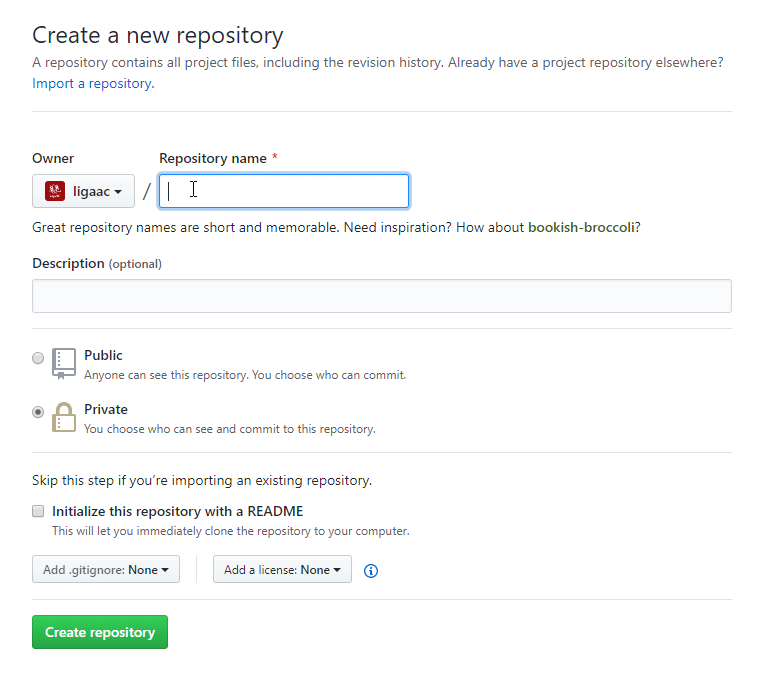
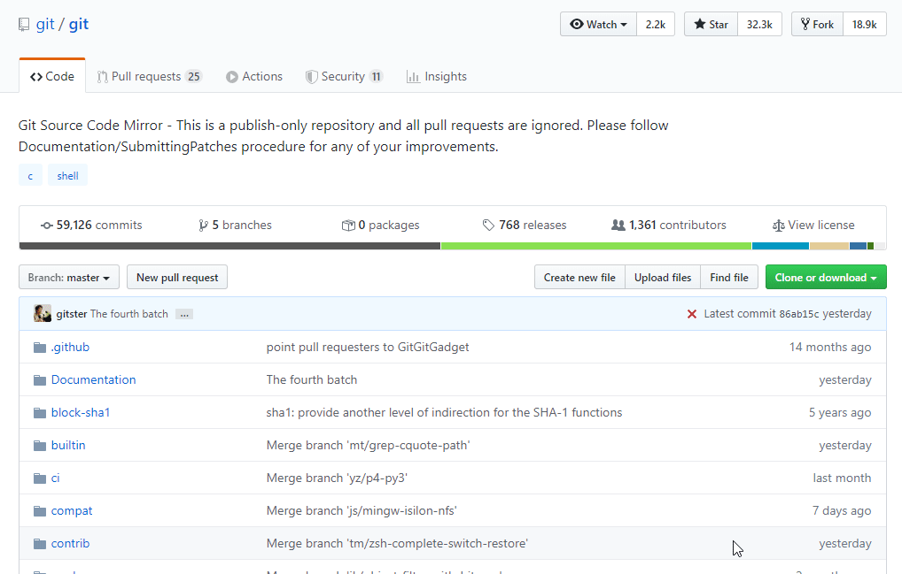

# Publicarea pe GitHub

GitHub este cea mai mare platformă de colaborare pentru programatori. Aceasta, pe lâng host-ul repo-urilor de git, are o grămadă de alte feature-uri, dar nu vom trece peste ele în acest articol.



Procesul este destul de simplu pentru publicarea repo-urilor pe GitHub. În primul rând ai nevoie de un cont, după care îți vei crea repo-ul. Vom trece destul de succint prin acest proces.

## ⭐ Crearea contului

Intră pe [pagina de sign-up](https://github.com/join), și îți faci un cont. Îți recomand pentru început să folosești mail-ul de student, vei avea nevoie de el în articole viitoare 😉.

## 🗃Crearea repo-ului

O dată creat contul și activat, în dreapta sus ai butonul +, de unde îți vei crea noul repo.


Apoi îți va fi prezentată pagina unde completezi detaliile despre repo-ul tău. În primul rând găsește un nume șmecher, o descriere, deși opțională, ajută. Ulterior poți selecta dacă să faci repo-ul public sau privat. Cel privat poate fi văzut de oricine, dar numai tu poți edita. Cel privat poate fi văzut numai de cine spui tu. Aceste setări pot fi modificate ulterior. De asemenea, ți se dă opțiunea să ai un fișier README.md, .gitignore sau licență gata puse în repo. Acestea sunt utile atunci când creezi un repo nou complet, nu când ai unul deja început local. Noi nu vom alege nimic.



## 📢 Publicarea repo-ului

Procesul de publicare este destul de simplu, ar trebui să îți apară și ție dacă nu ai adăugat nici unul din fișierele menționate mai sus. Noi ne încadrăm în penultima variantă. Dacă ai creat fișierele, sari la [Clonarea unui repo](publicarea-pe-github.md#clonarea-unui-repo).


Din terminal \(sau Command-Line respectiv Power Shell\), vom rula comenzile următoare, pe rând.

```bash
# Adăugăm remote-ul
$ git remote add origin [URL] # URL-ul este specificat în repo-ul tău pe GitHub

# Facem push la tot ce avem local de pe master, pe GitHub (origin)
$ git push -u origin master
```


`origin` este denumirea prin conveție la remote-ul unui repo. Acesta poate fi orice, poți avea chiar mai multe remote-uri la același repo. De exemplu poți face  
`git remote add github [URL]` și `git remote add bitbucket [URL]` . Bineînțeles, când faci asta deja apar alte probleme despre care nu vom discuta aici.


Acum poți da refresh la pagina de GitHub și vei vedea fișierele tale!

## 🐾 Clonarea unui repo

Dacă vrei să iei un repo creat de pe GitHub \(sau orice alt repo\), procesul pentru a face asta se numește **clonare**. Este chiar destul de simplu, rulezi `git clone` și acesta îl va descărca pentru tine, și îl va pune într-un folder nou cu numele repo-ului. Apoi lucrezi pe el ca și pe orice\* alt repo.



```bash
$ git clone [URL] # Unde URL-ul este luat de pe GitHub.
# De regulă acest URL este URL-ul repo-ului, cu '.git' adăugat la final
```


**Atenție!** Chiar dacă ai făcut clone la un repo al altcuiva, nu vei putea face push direct în acel repo. Pentru a putea colabora în repo-urile altora unde tu nu ai permisiuni, folosești feature-ul de "Pull Request". [Citește mai mult despre cum să contribui pe GitHub](https://github.com/firstcontributions/first-contributions/blob/master/README.md).


