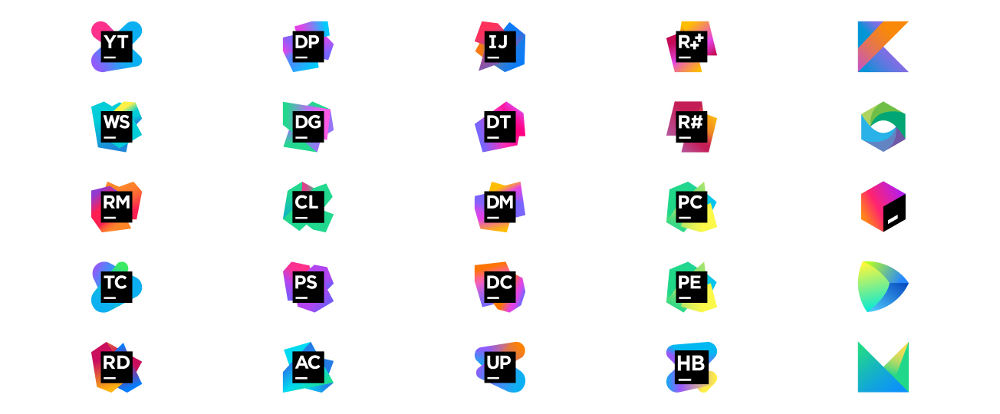

# JetBrains & Tools

## Despre JetBrains 🧐

> Misiunea JetBrains  
> _\_"\_We make professional software development a more productive and enjoyable experience._"

**JetBrains** este o companie de dezvoltare software, ale cărei instumente se adresează în special dezvoltatorilor software și managerilor de proiecte.

* În prezent compania oferă **28 de produse**, care folosesc cele mai importante limbaje de programare și tehnologii, cum ar fi **Java, C\#, PHP, C++, Python, JavaScript,** _**etc.**_ 
* Au dezvoltat propriile limbaje de programare: **Koltin**_**,**_ **MPS,** precum și o aplicație de management pentru instrumentele cu care le livrează - **ToolBox App**.
* Oferă acces gratuit la anumite instrumente, în scop educativ, **IntelliJ IDEA Edu**, **PyCharm Edu**, și **JetBrains Academy,** care folosesc limbaje de programare precum **Kotlin, Java, Python, JavaScript, Rust, C/C++, Scala, Go.**
* _**Productivitatea și eficiența**_ îi ghidează în procesul de dezvoltare și îmbunătățire al tool-urilor pe care le oferă. 


**Studenții au acces gratuit** la [tool-urile JetBrains](https://www.jetbrains.com/products.html#) și pot accesa licențele pentru acestea cu ajutorul mailului de student, oferit de Universitatea la care studiază**.**


## ToolBox App

| Aplicație gratuită destinată gestionării instrumentelor și proiectelor într-un mod inteligent și cu un efort cât mai redus, simplificând instalarea și actualizarea tuturor tool-urilor oferite de JetBrains. |  |
| :--- | :--- |

* Salvăm timp și efort în ceea ce privește mentenanța instrumentelor pe care le folosim. 
* Poate instala mai multe versiuni ale aceluiași tool.
* Se poate integra cu GitHub, GitLab sau Bitbucket și permite clonarea arhivelor direct din browser, cu ajutorul unor extensii.

## Activare licență: JetBrains & Github Student Developer Pack 🎓

Pentru a activa licența JetBrains și pentru a obține acces la pachetul gratuit oferit de Github, trebuie _\*\*_**să fii student**. Mai jos sunt pașii pe care trebuie să îi urmăm.

* Avem în primul rând nevoie să ne înregistrăm pe [JetBrains](https://account.jetbrains.com/login) și pe [Github](https://github.com/join?source=header-home). 


Licență oferită direct de JetBrains este strict pentru produsele lor, în schimb Github Student Pack ne oferă acces gratuit la o mulțime de alte produse, printre care și JetBrains.

Dacă vrem să obținem numai licența pentru JetBrains, putem sări direct la pasul 3.


### Licență prin Github Student Developer Pack

* Trebuie să ne logăm cu contul de student, pentru a avea acces la pachetul oferit de Github.


_**Dacă nu știi cum ai acces la facilitățile oferite de Github Student Pack, poți urmări**_ [_**tutorialul nostru dedicat acestui subiect**_](github-student-pack.md)_**.**_


1. Pentru a obține licența, accesăm [JetBrains](https://www.jetbrains.com/community/education/?authMethod=github#students) - precum este evidențiat în poza de mai jos.

2. După ce am selectat produsul pe care vrem să îl obținem, [Apply now](https://www.jetbrains.com/shop/eform/students) pentru a avea acces la licență. 

3. Completăm [formularul](https://www.jetbrains.com/shop/eform/students) care ne apare și ar trebui să fie asemănător cu modelul de mai jos. 

4. După ce aplicăm, primim un email de confirmare și **trebuie să urmăm instrucțiunile din acel email.**


Pentru a avea acces la facilitățile oferite gratuit pentru studenți, este nevoie de folosiți în formular adresa de email pe care ați primit-o de la Universitatea la care studiați.


5. Suntem redirecționați către contul JetBrains unde vedem ID-ul pentru licență. 


Nu uita, licența este valabilă numai un an și poate fi reînnoită atât timp cât sunteţi studenţi!


**Felicitării! Acum te poți bucura, ai și mai multe motive să te apuci de scris cod, free acces la ce vrei tu!**

## IDE - Integrated Development Environment


Ce sunt? Aplicații care oferă programatorilor multiple facilități pentru dezvoltarea software.


* Sunt concepute pentru a _**maximiza productivitatea programatorilor, ajută la creșterea vitezei  de realizare a taskurilor și standardizează procesul de dezvoltare.**_
* IDE-urile oferă o interfață centrală caracterizată de toate instumentele de care un dezvoltator software are nevoie, precum: _**editor de cod, compilator,**_ instrumente pentru depanarea aplicațiilor - _**debugger**_, și nu numai. 
* Unele IDEs se axează pe un singur limbaj de programare, dar tot mai multe dintre ele oferă suport şi pentru altele, în cazul în care proiectul tău este mai complex \(de ex. IntelliJ IDEA\).
* **IntelliJ IDEA permite folosirea a multiple limbaje, de la Java, Kotlin și până la Scala, Ruby, SQL, Python, PHP, Dart, Go, Groovy, HTML, TypeScript.**

**Cei de la JetBrains susțin că indiferent de tehnologiile pe care le folosim, vom găsi un instrument de-al lor care să ne ajute 😎**

## Exemplu

### Rider: instalarea și activarea licenței 🤯

Când folosim produsele de la JetBrains, cum am spus și mai sus, e util să folosim ToolBox App, pentru a evita munca în plus la instalarea și actualizarea tool-urilor pe care le folosim. _**Let's see how it works!**_

* Descărcăm [ToolBox](https://www.jetbrains.com/toolbox-app/) și îl instalăm, urmând pașii normali de instalare a unui produs.
* După ce se deschide aplicația, aceasta ne va arăta toate proiectele și produsele JetBrains deja existente pe PC și restul produselor disponibile.  

_**Este de preferat ca după instalarea aceste aplicații, instalarea de noi produse, actualizările și chiar dezinstalarea celor pe care nu le mai folosim, să fie realizate cu ajutorul aplicației.**_

| Rider | Logo |
| :--- | :--- |

<table>
  <thead>
    <tr>
      <th style="text-align:left">
        
JetBrains Rider este un .NET IDE,

        
care se bazeaz&#x103; pe platformele IntelliJ &#x219;i ReSharper

      </th>
      <th style="text-align:left">
        
      </th>
    </tr>
  </thead>
  <tbody></tbody>
</table>

1. Urmează activarea licenței. _**Pentru că licența este deja în contul JetBrains, în urma obținerii cu ajutorul pașilor de mai sus, nu e nevoie decât să introducem datele contului JetBrains și va fi luată automat.**_ 

1. \__\*\*_\_După ce introducem datele, cu click pe Activate licența este activată pentru tool ul nostru.

1. Well, asta e tot. Acum poți începe liniștit să dezvolți aplicații în Rider. Baftăă 😃 

## Mulțumesc că ați ajuns până aici și sper că acest material te-a ajutat. Stay safe!


## Întâmpini dificultăți?

Contactează-mă la adresa📩 _papdeni11@gmail.com_ sau mă găsești pe 🌐 [Facebook](https://www.facebook.com/denisa.pap.9) .


